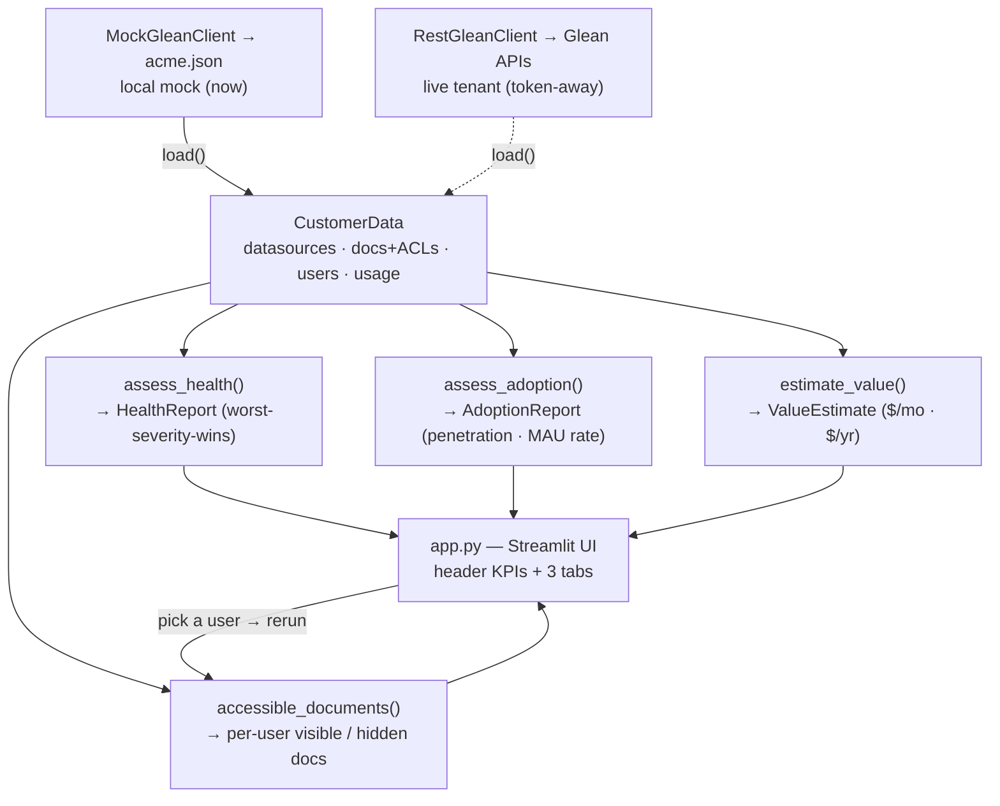

# Glean Deployment Health & Adoption Cockpit

A tool for a Glean **AI Success Manager** to monitor a customer's deployment: platform
**health**, **adoption**, permission **governance**, and an EBR-ready **business value**
figure — over a data model shaped on Glean's real Indexing & Insights API schemas.

> Built as a pairing/interview project. Data is mock, but modeled on Glean's actual
> API contracts, and all data access goes through a `GleanClient` interface — so it's
> "a token away" from running against a live tenant.

## What it shows
- **Platform health** — datasource sync freshness, SSO posture, and governance (over-sharing) findings, rolled up worst-severity-wins.
- **Adoption** — license penetration *and* Glean's own adoption rate (Glean MAU / total MAU), plus stickiness, per department; flags stalled teams.
- **Permission inspector** — pick a user, see exactly which documents Glean would surface for them (inclusive allow-list ACLs enforced).
- **Business value** — quantified monthly/annual ROI from search time saved + ticket deflection, with transparent, editable assumptions.

## Architecture
```
data/acme.json  ──►  cockpit.py (pure, tested core)  ──►  app.py (thin Streamlit UI)
                         ▲
                 GleanClient interface
              MockGleanClient (JSON, now) / RestGleanClient (live APIs, later)
```
- **`cockpit.py`** — all business logic as pure functions (health, permissions, adoption, value). No UI imports; fully unit-tested.
- **`app.py`** — presentation only; calls the core and lays out the results.
- **`GleanClient`** — adapter seam; swap mock for live without touching logic.

## Workflow
How data flows at runtime — one swappable source in, four independent assessments, one UI:



## Try it yourself (no coding experience needed)
The cockpit runs entirely on your own computer — nothing leaves your machine, and the data is fictional ("Acme Corp").

**You'll need:** Python 3.9 or newer — a free download from [python.org](https://www.python.org/downloads/). Nothing else.

**1 · Get the files.** Either click the green **`Code ▸ Download ZIP`** button near the top of this page and unzip it, or — if you use Git — run `git clone https://github.com/corduroyfields/glean-cockpit.git`.

**2 · Open a terminal in that folder.**
- **macOS:** open the **Terminal** app, type `cd ` (with a trailing space), drag the unzipped folder onto the window, then press **Enter**.
- **Windows:** open the unzipped folder, click the address bar, type `powershell`, then press **Enter**.

**3 · Copy-paste these lines one at a time, pressing Enter after each.**

macOS / Linux:
```bash
python3 -m venv .venv
source .venv/bin/activate
pip install -r requirements.txt
streamlit run app.py
```

Windows (PowerShell):
```powershell
python -m venv .venv
.venv\Scripts\Activate.ps1
pip install -r requirements.txt
streamlit run app.py
```

**4 · The app opens in your browser** at `http://localhost:8501`. If it doesn't open on its own, click that link.

The first run takes a minute while it downloads Streamlit; after that it's instant. To stop it, return to the terminal and press **Ctrl + C**.

## Tests
```bash
.venv/bin/python tests/test_cockpit.py   # standalone, no deps
# or, with pytest installed:
.venv/bin/python -m pytest tests/
```

## Layout
| File | Purpose |
|---|---|
| `cockpit.py` | Core logic + data model + `GleanClient` adapter |
| `app.py` | Streamlit UI (thin layer) |
| `data/acme.json` | Mock customer, Glean-shaped (datasources, documents+ACLs, users, groups, usage) |
| `tests/test_cockpit.py` | Unit tests for the core |
| `DEMO_SCRIPT.md` | 5-minute walkthrough |
| `JOINT_SUCCESS_PLAN.md`, `GOLIVE_RUNBOOK.md` | AISM delivery artifacts |
